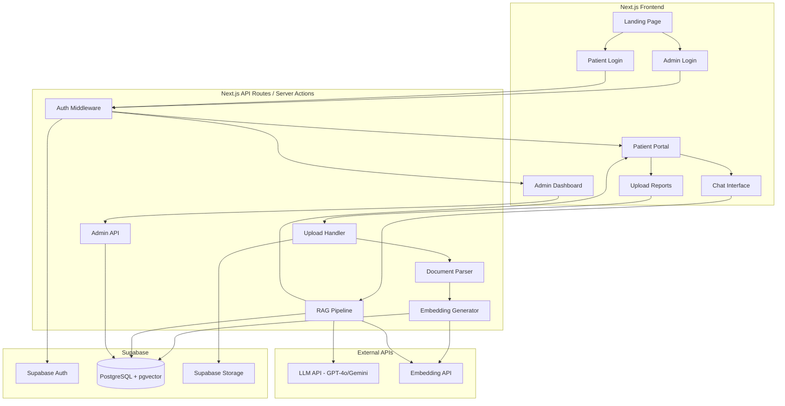
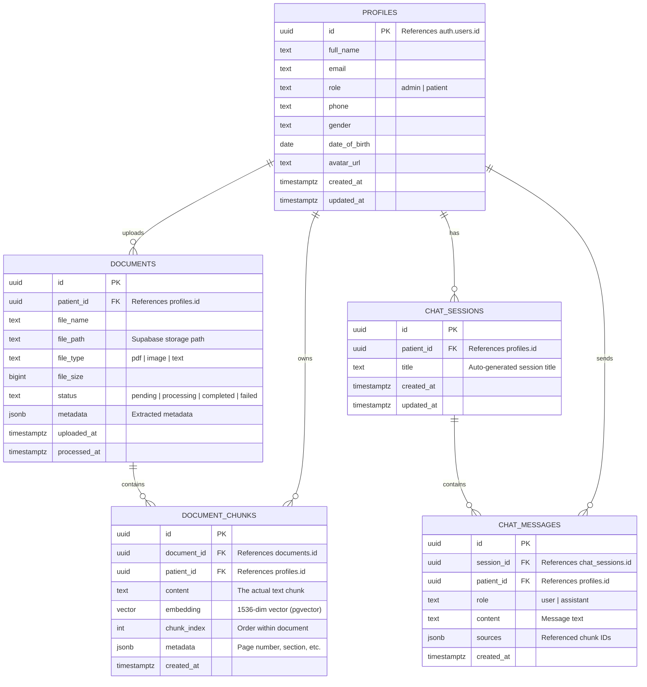
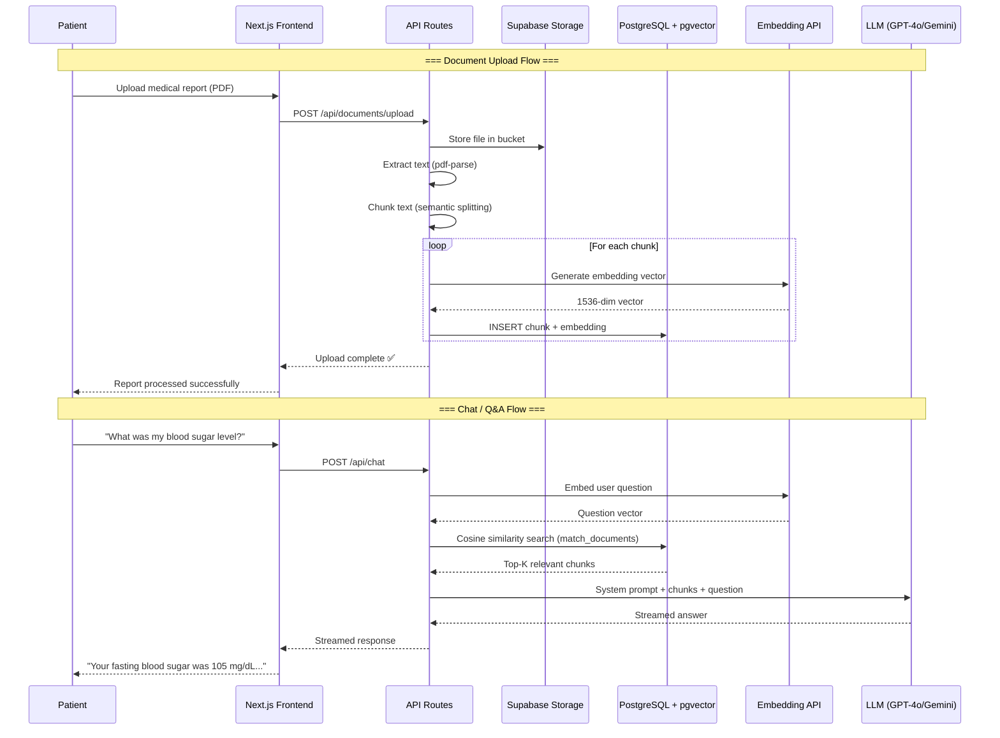

# RAG-Based MedicBot — Architecture & Implementation Plan

A full-stack medical RAG chatbot that scans user-uploaded medical reports (PDFs, images) and answers patient questions based on the extracted data. The system uses **Supabase** for auth, storage, and database — with **pgvector** as the vector database.

> [!IMPORTANT]
> **Security is built into every layer from day one.** Full security protocol with 12 defense layers and 15 attack vectors covered is documented in [SECURITY.md](file:///f:/medic bot/SECURITY.md).

---

## Vector Database Recommendation: **Supabase pgvector**

> [!IMPORTANT]
> After research, **pgvector (via Supabase)** is the best choice for this project. Here's why:

| Criteria | pgvector (Supabase) | Pinecone | Weaviate |
|---|---|---|---|
| **Unified with existing stack** | ✅ Same DB as patient data | ❌ Separate service | ❌ Separate service |
| **Row Level Security (medical data)** | ✅ Native Postgres RLS | ❌ External | ❌ External |
| **Cost** | ✅ Included in Supabase plan | 💰 Separate billing | 💰 Separate billing |
| **ACID compliance** | ✅ Full | ❌ Eventual consistency | ❌ Eventual consistency |
| **Setup complexity** | ✅ Zero — just enable extension | Medium | High |
| **Scale (vectors)** | ~100M+ | Billions | Billions |

**Verdict:** pgvector keeps everything in one place — patient records, document chunks, embeddings, and auth — all secured by Postgres RLS. No data sync headaches, no extra billing.

---

## Technology Stack

| Layer | Technology | Purpose |
|---|---|---|
| **Frontend** | Next.js 15 (App Router) + TypeScript | UI, routing, SSR |
| **Styling** | Tailwind CSS v4 + shadcn/ui | Premium UI components |
| **Auth** | Supabase Auth (`@supabase/ssr`) | Cookie-based auth, RBAC |
| **Database** | Supabase PostgreSQL + pgvector | Relational data + vector embeddings |
| **Storage** | Supabase Storage | Medical report file storage |
| **PDF Parsing** | `pdf-parse` + OCR fallback | Extract text from uploaded documents |
| **Embeddings** | OpenAI `text-embedding-3-small` (or Google Gemini) | Convert text → vectors |
| **LLM** | OpenAI GPT-4o / Google Gemini | Generate answers from retrieved context |
| **Vector Search** | pgvector cosine similarity (`<=>`) | Semantic search over document chunks |

> [!NOTE]
> **LLM Provider Decision Required:** We can use either **OpenAI** or **Google Gemini** for both embeddings and chat. Which do you prefer? This affects API keys and cost.

---

## Application Architecture



---

## Database Schema



---

## Project Structure

```
medic-bot/
├── .env.local                          # API keys (NEVER committed)
├── next.config.ts
├── package.json
├── tsconfig.json
├── tailwind.config.ts
│
├── public/
│   └── assets/                         # Static assets (logo, icons)
│
├── src/
│   ├── app/
│   │   ├── layout.tsx                  # Root layout (fonts, providers)
│   │   ├── page.tsx                    # Landing page
│   │   ├── globals.css                 # Global styles
│   │   │
│   │   ├── (auth)/                     # Auth route group
│   │   │   ├── login/
│   │   │   │   └── page.tsx            # Unified login (role selector)
│   │   │   ├── register/
│   │   │   │   └── page.tsx            # Patient registration
│   │   │   └── layout.tsx              # Auth layout (centered card)
│   │   │
│   │   ├── (admin)/                    # Admin route group
│   │   │   ├── layout.tsx              # Admin layout (sidebar + guard)
│   │   │   ├── dashboard/
│   │   │   │   └── page.tsx            # Admin overview (stats)
│   │   │   └── patients/
│   │   │       ├── page.tsx            # All patients list
│   │   │       └── [id]/
│   │   │           └── page.tsx        # Individual patient detail
│   │   │
│   │   ├── (patient)/                  # Patient route group
│   │   │   ├── layout.tsx              # Patient layout (sidebar + guard)
│   │   │   ├── dashboard/
│   │   │   │   └── page.tsx            # Patient home
│   │   │   ├── reports/
│   │   │   │   ├── page.tsx            # View uploaded reports
│   │   │   │   └── upload/
│   │   │   │       └── page.tsx        # Upload new report
│   │   │   ├── chat/
│   │   │   │   ├── page.tsx            # Chat sessions list
│   │   │   │   └── [sessionId]/
│   │   │   │       └── page.tsx        # Active chat with RAG bot
│   │   │   └── profile/
│   │   │       └── page.tsx            # Patient profile/settings
│   │   │
│   │   └── api/                        # API route handlers
│   │       ├── auth/
│   │       │   └── callback/
│   │       │       └── route.ts        # Supabase auth callback
│   │       ├── documents/
│   │       │   ├── upload/
│   │       │   │   └── route.ts        # Upload & trigger processing
│   │       │   └── process/
│   │       │       └── route.ts        # Parse, chunk, embed document
│   │       └── chat/
│   │           └── route.ts            # RAG chat endpoint (streaming)
│   │
│   ├── components/
│   │   ├── ui/                         # shadcn/ui primitives
│   │   │   ├── button.tsx
│   │   │   ├── card.tsx
│   │   │   ├── input.tsx
│   │   │   ├── dialog.tsx
│   │   │   ├── table.tsx
│   │   │   ├── badge.tsx
│   │   │   ├── avatar.tsx
│   │   │   ├── sidebar.tsx
│   │   │   └── ...
│   │   ├── admin/
│   │   │   ├── patients-table.tsx      # Patient data table
│   │   │   ├── stats-cards.tsx         # Dashboard metrics
│   │   │   └── admin-sidebar.tsx       # Admin navigation
│   │   ├── patient/
│   │   │   ├── report-card.tsx         # Document preview card
│   │   │   ├── upload-dropzone.tsx     # Drag & drop upload
│   │   │   ├── chat-interface.tsx      # Main chat UI
│   │   │   ├── chat-message.tsx        # Individual message bubble
│   │   │   ├── chat-input.tsx          # Message input with send
│   │   │   └── patient-sidebar.tsx     # Patient navigation
│   │   └── shared/
│   │       ├── logo.tsx                # App logo component
│   │       ├── theme-toggle.tsx        # Dark/light mode
│   │       ├── loading-spinner.tsx     # Skeleton/spinner
│   │       └── empty-state.tsx         # "No data yet" placeholder
│   │
│   ├── lib/
│   │   ├── supabase/
│   │   │   ├── client.ts              # Browser Supabase client
│   │   │   ├── server.ts              # Server-side Supabase client
│   │   │   └── admin.ts               # Service-role client (server only)
│   │   ├── rag/
│   │   │   ├── parser.ts              # PDF/image text extraction
│   │   │   ├── chunker.ts             # Semantic text chunking
│   │   │   ├── embedder.ts            # Generate embeddings via API
│   │   │   ├── retriever.ts           # pgvector similarity search
│   │   │   └── generator.ts           # LLM prompt + response
│   │   ├── utils.ts                   # General helpers
│   │   └── constants.ts               # App-wide constants
│   │
│   ├── hooks/
│   │   ├── use-auth.ts                # Auth state hook
│   │   ├── use-chat.ts                # Chat state management
│   │   └── use-documents.ts           # Document operations
│   │
│   ├── types/
│   │   ├── database.types.ts          # Supabase generated types
│   │   ├── chat.ts                    # Chat-related types
│   │   └── documents.ts              # Document-related types
│   │
│   └── middleware.ts                  # Route protection + role redirect
│
├── supabase/
│   ├── config.toml                    # Supabase local config
│   └── migrations/
│       ├── 001_enable_pgvector.sql    # Enable vector extension
│       ├── 002_create_profiles.sql    # Profiles table + trigger
│       ├── 003_create_documents.sql   # Documents table
│       ├── 004_create_chunks.sql      # Document chunks + vector index
│       ├── 005_create_chat.sql        # Chat tables
│       ├── 006_create_rls.sql         # Row Level Security policies
│       ├── 007_create_storage.sql     # Storage bucket policies
│       └── 008_create_functions.sql   # Match documents function
│
└── scripts/
    └── seed-admin.ts                  # One-time admin user creation
```

---

## RAG Pipeline Flow



---

## Key Supabase SQL Functions

### `match_documents` — Vector Similarity Search
```sql
CREATE OR REPLACE FUNCTION match_documents(
  query_embedding vector(1536),
  match_count int DEFAULT 5,
  filter_patient_id uuid DEFAULT NULL
)
RETURNS TABLE (
  id uuid,
  content text,
  metadata jsonb,
  similarity float
)
LANGUAGE plpgsql
AS $$
BEGIN
  RETURN QUERY
  SELECT
    dc.id,
    dc.content,
    dc.metadata,
    1 - (dc.embedding <=> query_embedding) AS similarity
  FROM document_chunks dc
  WHERE
    (filter_patient_id IS NULL OR dc.patient_id = filter_patient_id)
  ORDER BY dc.embedding <=> query_embedding
  LIMIT match_count;
END;
$$;
```

---

## Row Level Security (RLS) Strategy

| Table | Patient Policy | Admin Policy |
|---|---|---|
| `profiles` | Can read/update own profile only | Can read all profiles |
| `documents` | Can CRUD own documents only | Can read all documents |
| `document_chunks` | Can read own chunks only | Can read all chunks |
| `chat_sessions` | Can CRUD own sessions only | No access |
| `chat_messages` | Can CRUD own messages only | No access |

---

## User Flows

### Patient Flow
1. **Register** → Create account (email + password)
2. **Login** → Redirected to `/patient/dashboard`
3. **Upload Report** → Drag & drop PDF → auto-processed (parsed, chunked, embedded)
4. **Chat** → Ask questions about their reports → RAG retrieves relevant chunks → LLM answers
5. **View Reports** → See all uploaded reports with status

### Admin Flow
1. **Login** → Redirected to `/admin/dashboard`
2. **Dashboard** → See stats (total patients, documents, chats)
3. **Patient List** → View all registered patients
4. **Patient Detail** → See a specific patient's reports and metadata

> [!NOTE]
> Admin accounts are created via a seed script (`scripts/seed-admin.ts`), NOT through the registration page. Registration is for patients only.

---

## Implementation Phases

### Phase 1: Foundation (Structure + Auth + Security Core)
- Initialize Next.js project with TypeScript
- Set up Supabase project + environment variables
- Create database migrations (all tables + RLS with `FORCE`)
- 🔒 Configure security headers in `next.config.ts` (CSP, HSTS, X-Frame-Options)
- 🔒 Create auth guard utilities (`requireAuth`, `requireAdmin`, `requirePatient`)
- 🔒 Create IDOR prevention utility (`verifyOwnership`)
- 🔒 Create input validation schemas (Zod) and sanitization (DOMPurify)
- 🔒 Create rate limiter configuration
- 🔒 Create file upload security (MIME + magic bytes validation)
- Implement authentication (login, register, middleware with `getUser()`)
- Build layouts for admin and patient route groups

### Phase 2: Admin Panel
- Admin dashboard with stats cards
- Patient listing table (empty state initially)
- Patient detail view
- Admin sidebar navigation
- 🔒 `requireAdmin()` on every admin page/API route
- 🔒 No-cache headers on all admin pages

### Phase 3: Patient Portal — Reports
- Report upload with drag & drop
- 🔒 File upload security (magic bytes + MIME + size limit + UUID rename)
- 🔒 Private Supabase Storage bucket + signed URLs (60s TTL)
- Supabase Storage integration
- Document listing with status
- Document processing pipeline (parse → chunk → embed)
- 🔒 Rate limiting on upload endpoint (10/hour)

### Phase 4: RAG Chat System
- Chat session management
- Chat UI (message bubbles, streaming)
- RAG pipeline (embed query → search → augment → generate)
- Source attribution in answers
- 🔒 IDOR protection on `/chat/[sessionId]` (ownership check + 404 not 403)
- 🔒 Chat message sanitization (DOMPurify)
- 🔒 Rate limiting on chat endpoint (20/min)

### Phase 5: Polish & Hardening
- Dark mode support
- Responsive design
- Error handling & toast notifications (generic error messages only)
- Loading states & skeletons
- 🔒 Full security audit against SECURITY.md checklist
- 🔒 `force-dynamic` + `no-store` on all sensitive pages
- 🔒 Verify `server-only` import on all server modules
- 🔒 Run `npm audit` for dependency vulnerabilities

---

## Open Questions

> [!IMPORTANT]
> **Please clarify these before I begin implementation:**

1. **LLM Provider:** Do you want to use **OpenAI (GPT-4o)** or **Google Gemini** for both embeddings and chat responses? This affects API keys and pricing.

2. **Styling Preference:** The research suggests **Tailwind CSS + shadcn/ui** as the standard for admin/portal apps. Are you okay with Tailwind, or do you want vanilla CSS as mentioned in the guidelines?

3. **Admin Creation:** Should the first admin be created via:
   - A seed script (run once manually), or
   - A special `/admin/setup` page (accessible only when no admins exist)?

4. **Document Types:** Should the system support only **PDFs**, or also **images** (JPG/PNG of scanned reports) and other formats?

5. **Do you already have a Supabase project created?** If yes, I'll need the project URL and anon key for `.env.local`.

---

## Verification Plan

### Automated Tests
- `npm run build` — Ensure zero TypeScript/build errors
- `npm run lint` — ESLint checks pass
- `npm audit` — Zero known vulnerabilities in dependencies

### Manual Verification
- Auth flow: Register → Login → Redirect based on role
- Admin panel: Empty state renders correctly
- Patient portal: Upload → Process → Chat flow
- Responsive: Works on mobile and desktop

### 🔒 Security Verification
- **IDOR Test**: Log in as Patient A, manually change URL to Patient B's chat session → must return 404
- **Role Escalation Test**: Patient tries to access `/admin/dashboard` → redirected to patient dashboard
- **API Role Test**: Patient sends request to `/api/admin/patients` → receives 403
- **RLS Test**: Use Supabase SQL editor to query as Patient A → only Patient A's rows returned
- **File Upload Test**: Upload a `.exe` file renamed to `.pdf` → rejected (magic bytes check)
- **Brute Force Test**: Attempt 6 login failures → rate limited with retry timer
- **Cache Test**: Open patient dashboard, view headers → `Cache-Control: no-store` present
- **Storage Test**: Try to access storage URL directly without signed token → access denied
- **XSS Test**: Send `<script>alert('xss')</script>` as chat message → rendered as plain text
- **Headers Test**: Inspect response headers → CSP, HSTS, X-Frame-Options all present
